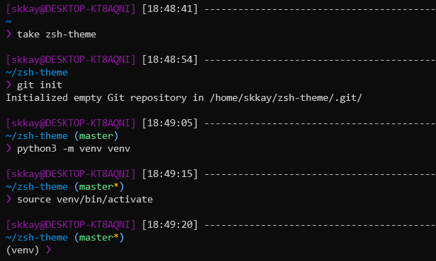

My ZSH theme inspired from `af-magic` and `Pure` themes.



## Install
- Git clone the project
- Create a symlink to the theme file in your oh-my-zsh themes directory
- Enable the theme `skkay.zsh-theme` in your `.zshrc` file

```bash
git clone https://github.com/Skkay/zsh-theme

ln -s \
    /path/to/repository/oh-my-zsh/skkay.zsh-theme \
    /home/$(whoami)/.oh-my-zsh/themes/skkay.zsh-theme

nano ~/.zshrc
# ZSH_THEME="skkay"
```
